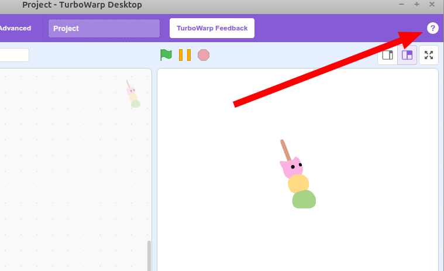
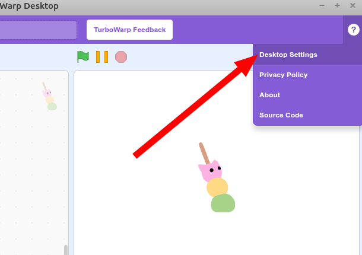
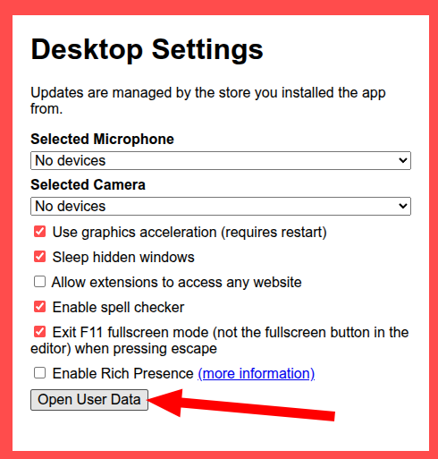
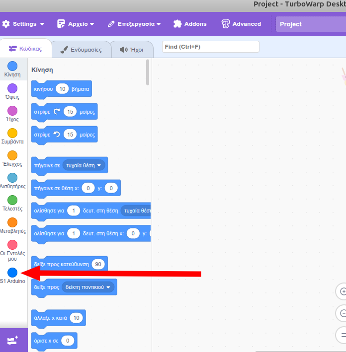

## Custom Turbowarp

Το έργο αυτό είναι ένα τροποποιημένο Turbowarp το οποίο επιτρέπει συνδέσεις μέσω Serial ώστε να υπάρχει **online επικοινωνία** με μια σειρά από μικροεπεξεργαστές όπως Arduino, Microbit κλπ.

# Χρήση

0. Κατεβάζεις από τα [releases](https://github.com/ale3andro/turbowarp_alx/releases) την τελευταία έκδοση της εφαρμογής για το λειτουργικό σου σύστημα.

1. Παίρνεις το αρχείο [userscript.js](./userscript.js) και το αντιγράφεις μέσα στον κατάλληλο φάκελο για το ΛΣ σου.

πχ για **Ubuntu/Linux** το αρχείο πρέπει να μπει μέσα στον φάκελο

```
~/.config/turbowarp-desktop/
```

για Windows το παραπάνω αρχείο πρέπει να μπει μέσα στον φάκελο

```
%APPDATA%/turbowarp-desktop
```

Για να βρεις με σιγουριά τον φάκελο, μπορείς να κάνεις κλικ στο εικονίδιο "?" στην πάνω δεξιά γωνία της εφαρμογής, 



και μετά να επιλέξεις το "Desktop Settings" 



και τέλος το "Open User Data"



Ξεκινάς την εφαρμογή turbowarp και το πρόσθετο / τα πρόσθετα πρέπει να είναι ήδη φορτωμένα!



Όταν γίνει κάποια αναβάθμιση στο πρόσθετο / στα πρόσθετα, αρκεί να ενημερωθεί το αρχείο [userscript.js](./userscript.js) και όχι ολόκληρη η εφαρμογή.

Καλή διασκέδαση!
