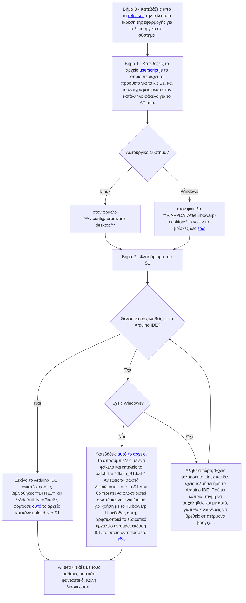

## Custom Turbowarp

Το έργο αυτό είναι ένα τροποποιημένο Turbowarp το οποίο επιτρέπει συνδέσεις μέσω Serial ώστε να υπάρχει **online επικοινωνία** με μια σειρά από μικροεπεξεργαστές όπως Arduino, Microbit κλπ.


# Χρήση (σε διάγραμμα ροής)



# Χρήση (ελεύθερο κείμενο)

0. Κατεβάζεις από τα [releases](https://github.com/ale3andro/turbowarp_alx/releases) την τελευταία έκδοση της εφαρμογής για το λειτουργικό σου σύστημα.

1. Παίρνεις το αρχείο [userscript.js](./userscript.js) (περιέχει το πρόσθετο για το κιτ S1) και το αντιγράφεις μέσα στον κατάλληλο φάκελο για το ΛΣ σου.

πχ για **Ubuntu/Linux** το αρχείο πρέπει να μπει μέσα στον φάκελο

```
~/.config/turbowarp-desktop/
```

για Windows το παραπάνω αρχείο πρέπει να μπει μέσα στον φάκελο

```
%APPDATA%/turbowarp-desktop
```

Αν δεν μπορείς να το βρεις τον φάκελο, δες αναλυτικότερες οδηγίες [εδώ](./README_how_find_the_user_folder.md)

Όταν γίνει κάποια αναβάθμιση στο πρόσθετο / στα πρόσθετα, αρκεί να ενημερωθεί το αρχείο [userscript.js](./userscript.js) και όχι ολόκληρη η εφαρμογή.

2. Στο τελευταίο βήμα, πρέπει να φλασαριστεί το S1 με ένα κώδικα Arduino. Σημείωση: Το φλασάρισμα γίνεται μόνο μια φορά, εφόσον δεν φορτωθεί κάτι άλλο στο Arduino S1. Εδώ υπάρχουν 2 επιλογές:

2α. Αν χρησιμοποιείς M$ Windows και δεν έχεις το Arduino IDE ή δεν θέλεις να ασχοληθεί με αυτό. Τότε κατεβάζεις [αυτό το αρχείο](./windows-helper/flash_s1_windows.zip). Το αποσυμπιέζεις σε ένα φάκελο και εκτελείς το batch file **flash_S1.bat**. Αν έχεις τα σωστά δικαιώματα, τότε το S1 σου θα πρέπει να φλασαριστεί σωστά και να είναι έτοιμο για χρήση με το Turbowarp. Η μέθοδος αυτή, χρησιμοποιεί το εξαιρετικό εργαλείο avrdude (έκδοση 8.1), το οποίο αναπτύσσεται [εδώ](https://github.com/avrdudes/avrdude)

2β. Αν έχεις το Arduino IDE, μπορείς να φλασάρεις κατευθείαν [αυτόν τον Arduino κώδικα](https://github.com/ale3andro/turbowarp_alx/blob/main/alx/s1-arduino.ino) από το Arduino IDE. Το φλασάρισμα γίνεται μόνο μια φορά, εφόσον δεν φορτωθεί κάτι άλλο στο Arduino. (ΣΗΜΕΙΩΣΗ: Πριν το φλασάρισμα πρέπει να εγκατασταθούν οι βιβλιοθήκες **DHT11** και **Adafruit_NeoPixel** μέσα από το Arduino IDE).

Μετά τα παραπάνω βήματα (προετοιμασία της εφαρμογής), ανοίγοντας το turbowarp, υπάρχει κάτω αριστερά στις ομάδες εντολών, η ομάδα S1 Arduino. Κάθε φορά που υπάρχει ενημέρωση στο πρόσθετο ή στα πρόσθετα (ετοιμάζω αντίστοιχο για το Gigo – Microbit) απαιτείται μόνο η λήψη / ενημέρωση του αρχείου userscript.js και σε μεγαλύτερες μόνο αναβαθμίσεις η ενημέρωση της εφαρμογής και του Αrduino sketch που τρέχει στο S1.

Σκοπός να μπορούμε να φτιάξουμε έργα σαν και [αυτό](https://youtube.com/shorts/8-5OmIsbpdE?si=OvPiYFLTkv0EDihD)

Καλή διασκέδαση!

## Χρήσιμος σύνδεσμος

<a href="https://base64.guru/converter/encode/text" target="_blank">Base64 encode</a>